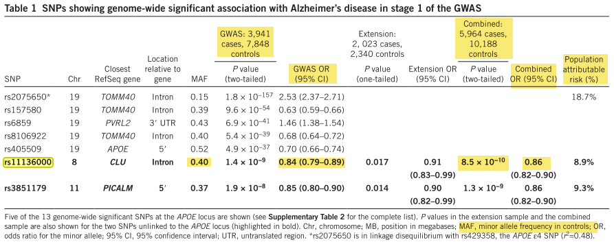
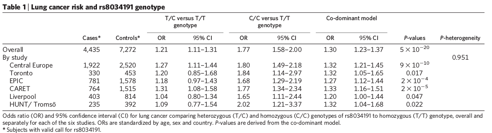
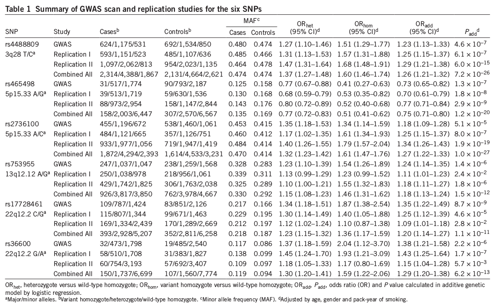

```{r echo=FALSE, results='hide'}
library('knitr')
setwd("/home/joseah/Documents/jeff_leek_lab/github/GWASanalysis/exploratory_data_analysis")
columns <- c("PUBMEDID", "LINK", "STUDY", "DISEASE.TRAIT", "INITIAL.SAMPLE.DESCRIPTION", "REPLICATION.SAMPLE.DESCRIPTION", "STRONGEST.SNP_RISK.ALLELE",
             "SNPS", "RISK.ALLELE.FREQUENCY", "P-VALUE", "ORorBETA")

assoc <- read.table("phenotypes_to_study_w_required_data", sep = "\t", 
                    col.names = columns, quote = "", comment.char = "")
assoc <- assoc[order(assoc$DISEASE.TRAIT),]
rownames(assoc) <- paste(seq_len(nrow(assoc)), assoc$SNPS, sep = "_")
assoc$CASES <- NA
assoc$CONTROLS <- NA
assoc$STAGE <- NA
assoc$CLINICAL.VARIABLES <- NA
assoc$NOTES <- NA
```

# Introduction

In order to calculate the sensitivity and specificity of genome-wide association studies, the following data are required:

- Number of cases
- Number of controls
- Risk allele frequency (RAF)
- Odd ratio

Additional data are also necessary for further analysis:

- Measured variables: different kind of variables measured for phenotyping, avoiding cofounding or stratifying populations.

---

# Stage of study: not matching variables

Usually, GWA studies consist on at least two stages:

- Stage 1: __Discovery__ study
- Stage 2: __Replication__ study

Most studies also include a __combined__ stage which is the result of merging the discovery and the replication stages.

Depending on the conducted strategies to analyze data or the available datasets (for example, using multiple cohorts), the __combined__ stage could consist on more than 2 study stages (besides discovery and replication).

Frequently, the highest p-value obtained corresponds to the __combined__ stage (likely due to an increment in sample sizes in cases and controls). Using the __combined__ stage seems to be a good way to evaluate the specificity and sensitivity of the association between SNPs and phenotypes considering that results from associations were previously identified and replicated.

---

### _Issue_: Risk allele frequency not provided for __combined__ stage

> Most studies only provide the risk allele frequency for the first stage and not for the combined stage. If the combined stage is going to be analyzed, it is not convenient to assume that the RAF for the combined stage is the same as the one reported in the first stage.

Example:



### _Solution_: Consider the biggest study 

> Take the stage with the biggest sample size for cases and controls, and reported RAF. For rs11136000, consider the following:

- Cases = 3941

- Controls = 7848

- MAF = 0.4

---

### _Issue_: Flipped odd ratio

For a lot of studies, the GWAS catalog flip the OR when this is lower than 1.

Example:
```{r reported odd ratio in catalog, echo=FALSE }
i = 3
snp <- assoc[i,]
kable(t(snp[,c("PUBMEDID", "STUDY", "STRONGEST.SNP_RISK.ALLELE","SNPS","ORorBETA")]))

```

And the paper says:

- Odd ratio = 0.86

If the reciprocal is calculated for this odd ratio, the same value of the catalog is obtained:

```{r flipped odd ratio}
round(1/0.86, 2)

```

### _Solution_: Identify the reason why this odd ratio is flipped (i.g. protective SNP)

> When consulting SNPedia, the following information about [Rs11136000](http://www.snpedia.com/index.php/Rs11136000) is provided:


|:--|--:|
|Orientation|   plus|
|Stabilized|	plus|
|Geno|	Mag	Summary|
|(C;C)|	0	normal|
|(C;T)|	1.5	0.84x decreased risk for Alzheimer's disease|
|(T;T)|	1.5	0.84x decreased risk for Alzheimer's disease|
|Reference|	GRCh38 38.1/141|
|Chromosome|	8|
|Position|	27607002|
|Gene|	CLU|
|is a|	snp|

It seems that __T__ is a protective allele since it is associated with a decreased risk for Alzheimer's disease.

Since the catalog reports the allele frequency for the _risk allele_, the odd ratio is flipped to indicate that having __C__ is associated with and odd ratio = 1/0.86 = `r round(1/0.86, 2)` and a RAF equal to 1 - 0.4 = `r 1 - 0.4`.

```{r echo=FALSE}
kable(t(snp[,c("PUBMEDID", "STUDY", "STRONGEST.SNP_RISK.ALLELE","SNPS","ORorBETA", "RISK.ALLELE.FREQUENCY")]))
```

---

# Genetic models added to GWAS

Sometimes, some genetic models are included in the analysis because there are evidence about the type of inheritance of diseases.

### Issue: How should the odd ratios be considered?

Consider the following examples:


- Codominant model


In this case, three odd ratios are reported:

- Heterozygote vs. Homozygote
- Homozygote vs. Homozygote
- Codominant model

__What odd ratio should be considered? How?__

- Additive model


In this case, three odd ratios are reported:

- Heterozygote
- Homozygote
- Additive model

Again: __What odd ratio should be considered? How?__
