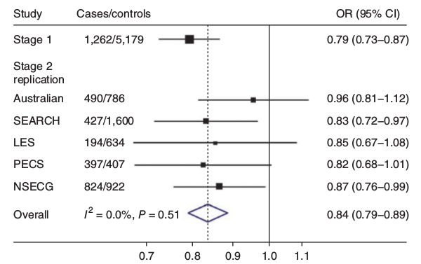
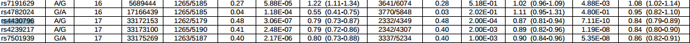
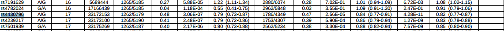
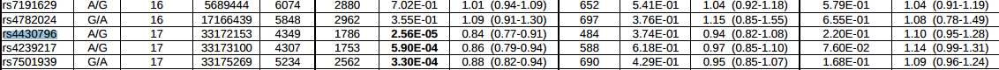

## Introduction
- There are 19603 studies in the NHGRI GWAS catalog
- There are 1257 phenotypes contained in the catalog reported as different

---

## Criteria for selecting phenotypes

- Clinically relevant
- Relatively easy to measure or determine (no anthropological measures)
- Well represented by a considerable number of studies in the catalog

---

As an exploratory phase, I have been focused on the following phenotypes:
- Depression (quantitative trait)
- Endometrial cancer
- Lymphoma
- Response to antidepressant treatment (citalopram)
- Response to tamoxifen in breast cancer 
- Breast cancer
- Breast Cancer in BRCA1 mutation carriers
- Response to mTOR inhibitor (rapamycin) 
- Multiple sclerosis 
- Ovarian cancer 
- Hypertension
- Lung cancer
- Autism

---

- Tuberculosis 
- Alzheimer's disease
- Major depressive disorder
- Epilepsy (generalized)
- Warfarin maintenance dose
- Response to hepatitis C treatment
- Rheumatoid arthritis
- Tuberculosis
- Diabetes

---
## Ambiguous phenotypes
- 10 Economic and political preferences (time)
- 12 Economic and political preferences (feminism/equality)
- 17 Economic and political preferences 
- 17 Economic and political preferences (environmentalism)
- 7 Economic and political preferences (fairness)
- 15 Economic and political preferences (immigration/crime)
- 10 Reading and spelling
- 10 Relative hand skill in reading disability
- 13 Preschool internalizing problems

---

- 19 Political ideology
-  1 Mathematical ability in children with dyslexia
-  1 Musical aptitude
- 22 Intelligence
-  2 Mathematical ability
- 15 Word reading
- 14 Educational attainment

---

## Exploratory data analysis

Studies where sample size for case and controls populations, and odd ratio have been explicitly reported in the GWAS catalog will be considered to calculate the specificity and sensitivity.

- Depression (quantitative trait)
- Endometrial cancer
- Lymphoma
- Response to antidepressant treatment (citalopram)
- Response to tamoxifen in breast cancer 
- Breast cancer

---

## Breast cancer example

- PubMed ID : 24143190
- Study title: Genome-wide association study of breast cancer in the Japanese population.
- Link: http://www.ncbi.nlm.nih.gov/pubmed/24143190
- Risk allele frequency: 0.514
- SNP: rs2981578
- p-value: 1E-12
- Odd ratio: 1.23
- Population: Japanese (2,642 Japanese ancestry cases, 2,099 Japaneses ancestry controls) (2,885 Japanese ancestry cases, 3,395 Japaneses ancestry controls)

---

---

## Endometrial cancer

- PubMed ID : 21499250
- Study title:  Genome-wide association study identifies a common variant - associated with risk of endometrial cancer.
- Link:  http://www.ncbi.nlm.nih.gov/pubmed/21499250
- Risk allele frequency: 0.52  
- SNP:  rs4430796
- p-value:  7E-10
- Odd ratio: 1.19
- Population:  1,265 European ancestry cases, 5,190 European ancestry controls	3,957 European ancestry cases, 6,886 European ancestry controls

---

- Risk allele frequency: 0.52  
- SNP:  rs4430796
- p-value:  7E-10
- Odd ratio: 1.19
- Population:  1,265 European ancestry cases, 5,190 European ancestry controls  3,957 European ancestry cases, 6,886 European ancestry controls

---

Figure 1  Forest plot showing the association between rs4430796 and
endometrial cancer for each component of the study. Study abbreviations
are as given in Supplementary Table 2. The SEARCH and Australian stage 2
replication sets excluded samples included in stage 1. The solid line
denotes the null, and the dashed line indicates the overall odds ratio (OR)
estimate. I 2 measures the heterogeneity in effect size between studies 36 .

 
- SNP:  rs4430796, p-value:  7E-10, Odd ratio: 1.19
- Population: 1,265 European ancestry cases, 5,190 European ancestry controls  3,957 European ancestry cases, 6,886 European ancestry controls

---

### Suplementary information

 
- SNP:  rs4430796, p-value:  7E-10, Odd ratio: 1.19
- Population: 1,265 European ancestry cases, 5,190 European ancestry controls  3,957 European ancestry cases, 6,886 European ancestry controls

---

## Thanks for listening!

